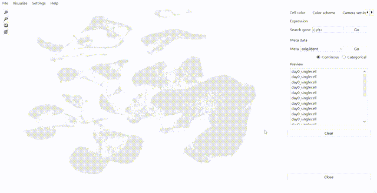

# GSCV
Graphical single cell viewer for PC and laptop.

Comparison between GSCV and Seurat FeaturePlot (GSE162610 with about 54000 cells and 24000 genes):

||GSCV (ms)|Seurat (ms)|
|----|----|----|
|Draw feature plot|5.15|1645.28|
|Resize plot|0.03|-|
|Open archive|120.40|13903.46|

||GSCV (MB)|Seurat (MB)|
|----|----|----|
|RES|148|4021|
|SHR|90|23|
|RES-SHR|58|3998|

## Prerequisites
+ Windows 10 or X11 (Mac OS is not supported yet)
+ OpenGL 3.3 or higher

## Installation
+ Windows users: Download the binary files on the release page and uncompress it.
+ Linux users: Download the repository and compile GSCV by using Qt Creator or Cmake.

### Compile from source code
To compile GSCV from source code, following dependencies are required:

+ Qt 6
+ zlib

#### Qt Creator
Linux users can open GSCV.pro by Qt Creator and compile it directly. Windows users need to customize the position of zlib.

Run "lrelease GSCV.pro" command, and copy "icon/", "shaders/", "doc/", "language/" to the program's directory. For Windows users, it is required to run "windeployqt build" command.

#### Cmake

First, download the repository and uncompress it (if needed).

1. wget https://
2. tar xzvf ... (if needed)
3. cd GSCV/

Use Cmake to configure the project and compile it (for Windows users, it is required to prepare zlib and modify CMakeLists.txt manually).

4. mkdir build
5. cd build
6. cmake ..
7. make
8. cd ..

Run "lrelease GSCV.pro" command, and copy "icon/", "shaders/", "doc/", "language/" to the program's directory. For Windows users, it is required to run "windeployqt build" command.

## Other
For more information, please refer to the document.
